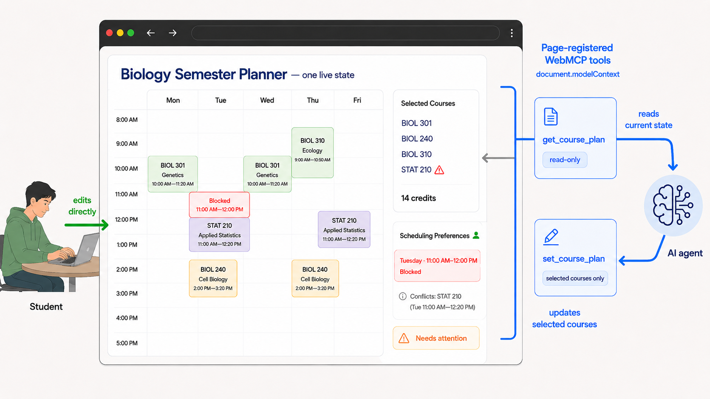

# WebMCP Course Planner

A university course planner where a student and an AI agent work on the same live webpage. The agent uses WebMCP tools instead of guessing its way through the UI.

**Live demo:** https://webmcp-course-planner.vercel.app

**Source:** https://github.com/TenzyZ/webmcp-course-planner

This fictional Biology semester-planning demo was built for the [OpenAI WebMCP Challenge](https://webmcp.devpost.com/).



## What is WebMCP Course Planner?

The planner combines a visual course-selection interface with two WebMCP tools. The student sets scheduling preferences, chooses courses, checks conflicts, and reviews the timetable. The agent reads the same current planning context and can replace the selected courses with valid catalog IDs.

This is not an embedded chatbot. The collaboration happens because the human UI and the WebMCP tools share one canonical React state.

## Why WebMCP?

Browser agents usually inspect the UI or DOM, locate controls, simulate clicks or typing, and then inspect the result. This planner gives the agent a smaller and clearer interface. `get_course_plan` reads the current planner state, while `set_course_plan` replaces the selected courses. React renders the result in the webpage.

The student can then change the same state through the UI. A later call to `get_course_plan` sees that newer state. **The human and agent work on the same live application state.**

## Golden workflow

The demo starts with Tuesday from 11:00 AM–12:00 PM available.

1. The agent reads the live plan and creates a selection that includes `stat-210`.
2. The webpage updates with the new selection.
3. The student blocks Tuesday from 11:00 AM–12:00 PM directly in the webpage.
4. The agent reads again and sees both the new preference and the resulting conflict.
5. STAT 210 is the only course that fulfills Statistics, so the agent explains the trade-off.
6. The student chooses to defer Statistics.
7. The agent restores the known conflict-free baseline. Statistics remains open, but the planner can still be ready.
8. The student reviews and confirms the fictional registration in the UI.

The conflict appears only after the human edit. The second tool read sees current state, not a stale snapshot.

## Shared-state architecture

`App` in `src/App.tsx` owns the canonical state through `planner` and `setPlanner`:

```ts
{
  maxCredits: number
  noEightAm: boolean
  fridayFree: boolean
  tuesdayElevenBlocked: boolean
  selectedIds: string[]
}
```

The controls and timetable render from this state. Student actions update it through React, and `set_course_plan` changes only `selectedIds` through the same state owner.

`plannerRef.current` mirrors the latest planner value for WebMCP executions. It is not a second state store or an independent mutation path; React remains the canonical owner.

## WebMCP tool contract

The planner exposes exactly two production tools through the [WebMCP Imperative API](https://developer.chrome.com/docs/ai/webmcp).

### `get_course_plan`

This is the read-only tool (`readOnlyHint: true`). It reads the complete planning context from the live planner state and returns:

```text
preferences
creditTotal
ready
conflicts
selectedCourseIds
requirements
catalog
```

Each requirement has `label`, `met`, and `courseIds`. The IDs come directly from `Requirement.fulfilledBy`:

```json
{
  "label": "Statistics",
  "met": false,
  "courseIds": ["stat-210"]
}
```

`conflicts` is a `string[]`, not an object schema. It contains deterministic messages such as `"Tuesday 11:00 AM is blocked"`, `"Over the 15-credit maximum"`, `"Includes an 8 AM class"`, `"Meets on Friday"`, and `"Two classes share a time"`.

The catalog includes course identity, credits, formatted meetings, selection status, and planning notes. It does not expose seat counts.

### `set_course_plan`

This tool can mutate state (`readOnlyHint: false`). It accepts:

```json
{
  "courseIds": [
    "biol-301",
    "biol-240"
  ]
}
```

`set_course_plan` replaces the complete selected-course set with valid catalog IDs. It does not toggle courses, add or remove them incrementally, or simulate UI clicks.

Only `planner.selectedIds` may change. The tool does not directly change `maxCredits`, `noEightAm`, `fridayFree`, `tuesdayElevenBlocked`, or the fictional registration confirmation.

Invalid input throws an exception:

| Input problem | Behavior |
| --- | --- |
| `courseIds` is not an array | `TypeError` |
| Any item is not a string | `TypeError` |
| Any course ID is unknown | `RangeError`; the plan remains unchanged |

On success, the tool returns `selectedCourseIds`, `creditTotal`, `ready`, and `conflicts`.

## Human and agent authority

| State or action | Human | Agent through WebMCP |
| --- | --- | --- |
| `maxCredits` | Owns the control, clamped from 6–21 | Reads only |
| `noEightAm` | Owns the control | Reads only |
| `fridayFree` | Owns the control | Reads only |
| `tuesdayElevenBlocked` | Owns the Tuesday 11:00 AM–12:00 PM control | Reads only |
| `selectedIds` | Can add or remove courses | Can replace the complete set |
| Fictional registration confirmation | Human only, and only when `ready` is true | No tool exists |

Confirmation records a signature of the current planner. If the planner changes later, that signature no longer matches, so the UI no longer treats the plan as confirmed. The student must review the changed schedule again. This is local UI behavior, not registrar or backend enforcement.

## Deterministic planner rules

The planner derives conflicts from the selected courses and the student's preferences:

- The selected plan must be non-empty.
- Credits must stay at or below the student-set maximum, which the UI clamps to 6–21.
- The "No 8 AM classes" preference flags selected courses that start before 9:00 AM. CHEM 110 at 8:00 AM is currently the only relevant catalog course.
- "Keep Friday free" flags any selected course with a Friday meeting.
- The Tuesday block covers the interval from 11:00 AM–12:00 PM and flags overlapping selected courses.
- Pairwise meeting overlaps produce a time-conflict message.

`ready` has one specific meaning:

```text
ready =
  selected plan is non-empty
  AND
  findConflicts(planner).length === 0
```

It does not mean that every Biology requirement is complete. A conflict-free plan can report `ready: true` while Statistics remains open.

## The Statistics trade-off

STAT 210 Applied Statistics is a 3-credit course that meets Tuesday and Thursday from 11:00 AM–12:20 PM. It is the only course in the Statistics requirement's `fulfilledBy` field.

Blocking Tuesday from 11:00 AM–12:00 PM makes STAT 210 conflict with the student's preference. The agent can explain the available choice: keep the blocked time and defer Statistics, or change the preference. It cannot change that human-owned preference itself.

When the student defers Statistics, the agent restores the original conflict-free baseline:

```text
biol-301  4 credits
biol-240  4 credits
chem-220  3 credits
biol-310  3 credits
          ──────────
total     14 credits
```

The Tuesday block remains in place. The resulting state has `creditTotal: 14`, `ready: true`, and `conflicts: []`, while Statistics remains open.

## Technology

- React 19
- TypeScript
- Vite
- WebMCP Imperative API
- Vercel deployment

## Run locally

You need Node.js and npm.

```bash
git clone https://github.com/TenzyZ/webmcp-course-planner.git
cd webmcp-course-planner
npm ci
npm run dev
```

Other project commands:

```bash
npm run lint
npm run build
npm run preview
```

## Test the WebMCP experience

### ChatGPT desktop Site Tools

[Site Tools](https://learn.chatgpt.com/docs/webmcp) can discover tools exposed by a webpage in ChatGPT's built-in browser. Availability depends on the desktop account, model, and runtime.

### Chrome

Use Chrome 149 or later:

1. Open `chrome://flags/#enable-webmcp-testing`.
2. Enable WebMCP testing.
3. Relaunch Chrome.
4. Install the [WebMCP - Model Context Tool Inspector](https://chromewebstore.google.com/detail/webmcp-model-context-tool/gbpdfapgefenggkahomfgkhfehlcenpd) extension.
5. Open the application.
6. Use the **WebMCP Model Context Tool Inspector** to inspect and manually invoke `get_course_plan` and `set_course_plan`.

## Suggested judge test

### Step 1: Read the current plan

Invoke `get_course_plan`. Confirm that Tuesday 11:00 AM–12:00 PM is available, then inspect the preferences, requirements, catalog, and baseline selection.

### Step 2: Include Statistics

Invoke `set_course_plan` with:

```json
{
  "courseIds": [
    "biol-301",
    "biol-240",
    "biol-310",
    "stat-210"
  ]
}
```

### Step 3: Change a preference in the webpage

In the webpage, set Tuesday 11:00 AM–12:00 PM to **Blocked**. This is a human edit, not a WebMCP action.

### Step 4: Read the newer state

Invoke `get_course_plan` again. The result should include the newer human-owned preference and the conflict `"Tuesday 11:00 AM is blocked"`.

### Step 5: Restore the baseline

Use `set_course_plan` to restore the application's original, known conflict-free baseline after the human-created conflict:

```json
{
  "courseIds": [
    "biol-301",
    "biol-240",
    "chem-220",
    "biol-310"
  ]
}
```

Expected planning result:

```text
creditTotal: 14
ready: true
conflicts: []
Statistics: still open
```

### Step 6: Review and confirm

Review and confirm the fictional registration in the UI. There is no WebMCP registration tool.

## Scope and limitations

This fictional demo does not implement or enforce:

- prerequisite validation or completed-course prerequisite checking
- seat availability, even though local course fixtures contain seat values
- registrar integration or real university registration
- authentication or a persistent student database
- registration holds or registration windows
- a multi-semester degree audit
- multi-agent architecture
- an embedded AI chatbot

`get_course_plan` does not return seat values, and the planner does not enforce seat availability. All planning and confirmation behavior is local to the demo.

## Design principles

- Keep one canonical React state for the visible UI and WebMCP tools.
- Expose one read tool and one bounded mutation tool.
- Derive credit, preference, and schedule conflicts in application code.
- Let the agent replan selected courses while the student retains preferences and final confirmation.
- Show agent changes immediately in the interface the student reviews.
- State the demo's limits without implying registrar, prerequisite, seat, or persistence support.

## Why this matters

WebMCP gives the agent a small set of actions that match the planner's domain instead of click-level control. The application keeps its validation and state model, while the student keeps scheduling preferences and final confirmation. Both work with the same live plan.

## License

Released under the [MIT License](./LICENSE).
